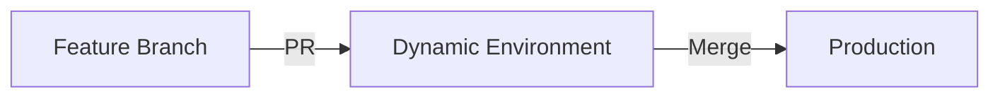
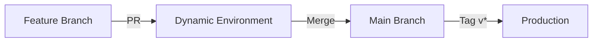
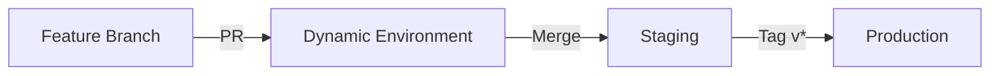

# Deployment Strategies

tachi supports three deployment strategies, each designed for different workflows and risk profiles. All strategies include dynamic PR environments.

## Overview

| Strategy | PR | Merge to Main | Tag (v*) | Best For |
|----------|-----|---------------|-----------|----------|
| `trunk-direct` | Dynamic env | → Production | N/A | Low-risk apps, internal tools |
| `trunk-release` | Dynamic env | No deploy | → Production | Controlled releases |
| `trunk-release-stage` | Dynamic env | → Staging | → Production | Critical apps needing validation |

## trunk-direct

### Overview
The simplest deployment strategy. Changes flow directly to production when merged to the main branch.

### Workflow


### When to Use
- Internal tools and dashboards
- Low-risk applications
- Rapid iteration environments
- Development/test projects

### Generated Workflows
- `pr-deploy.yaml` - Creates dynamic PR environments
- `pr-cleanup.yaml` - Cleans up PR environments
- `prod-deploy.yaml` - Deploys to production on merge

### Example Configuration
```yaml
name: internal-dashboard
strategy: trunk-direct

azure:
  resource_group: rg-tools
  registry: toolsregistry

services:
  - name: dashboard
    port: 3000
    external: true
```

## trunk-release

### Overview
Tag-based deployment strategy. Merging to main doesn't trigger deployments - only creating version tags deploys to production.

### Workflow


### When to Use
- Applications requiring explicit release control
- When you want to batch multiple changes
- Projects with scheduled releases
- When compliance requires release approval

### Generated Workflows
- `pr-deploy.yaml` - Creates dynamic PR environments
- `pr-cleanup.yaml` - Cleans up PR environments
- `prod-deploy.yaml` - Deploys to production on tag creation

### Example Configuration
```yaml
name: customer-api
strategy: trunk-release

azure:
  resource_group: rg-apis
  registry: apiregistry

services:
  - name: api
    port: 8080
    external: true
    cpu: 0.5
    memory: 1Gi
```

### Creating Releases
```bash
# After merging changes to main
git tag v1.2.3
git push origin v1.2.3
```

## trunk-release-stage

### Overview
Full pipeline with staging environment. Changes are validated in staging before production release.

### Workflow


### When to Use
- Production applications with high availability requirements
- Applications needing staging validation
- Complex deployments requiring testing
- When you need a production-like test environment

### Generated Workflows
- `pr-deploy.yaml` - Creates dynamic PR environments
- `pr-cleanup.yaml` - Cleans up PR environments
- `stage-deploy.yaml` - Deploys to staging on merge
- `prod-deploy.yaml` - Deploys to production on tag

### Example Configuration
```yaml
name: ecommerce-platform
strategy: trunk-release-stage

azure:
  resource_group: rg-ecommerce
  registry: ecommerceregistry
  log_analytics_workspace_id: ${LOG_ANALYTICS_ID}

services:
  - name: web
    port: 3000
    external: true
    cpu: 1
    memory: 2Gi
    min_replicas: 2
    max_replicas: 20
    
  - name: api
    port: 8080
    external: true
    cpu: 0.75
    memory: 1.5Gi
    min_replicas: 2
    max_replicas: 15
```

## Dynamic PR Environments

All strategies include dynamic PR environments with these features:

### Automatic Creation
- Environment spins up when PR is opened
- Unique URL for each PR
- Isolated from other environments

### PR Comments
- Automatic comment with environment URL
- Updates on each deployment
- Easy access for reviewers

### Automatic Cleanup
- Environment destroyed when PR is closed
- Saves costs and resources
- No manual intervention needed

### Example PR Comment
```
🚀 PR Environment deployed!

🌐 URLs:
- web: https://myapp-web-pr-123.azurecontainerapps.io
- api: https://myapp-api-pr-123.azurecontainerapps.io

📝 Deployment: #456 (commit abc123)
⏱️ Deployed at: 2024-01-15 10:30 UTC
```

## Choosing a Strategy

### Decision Matrix

| Factor | trunk-direct | trunk-release | trunk-release-stage |
|--------|--------------|---------------|---------------------|
| **Deployment Speed** | Fastest | Controlled | Controlled |
| **Risk Level** | Higher | Lower | Lowest |
| **Testing** | PR only | PR only | PR + Staging |
| **Rollback** | Redeploy | Previous tag | Previous tag |
| **Complexity** | Simple | Moderate | Higher |
| **Use Cases** | Dev tools | Scheduled releases | Critical apps |

### Questions to Ask

1. **How critical is the application?**
   - Low criticality → `trunk-direct`
   - High criticality → `trunk-release-stage`

2. **Do you need staging validation?**
   - Yes → `trunk-release-stage`
   - No → `trunk-direct` or `trunk-release`

3. **How often do you deploy?**
   - Multiple times per day → `trunk-direct`
   - Weekly/monthly → `trunk-release`

4. **What's your rollback strategy?**
   - Quick redeploy is OK → `trunk-direct`
   - Need version control → `trunk-release` or `trunk-release-stage`

## Migration Between Strategies

You can change strategies by updating your configuration:

```yaml
# Before
strategy: trunk-direct

# After
strategy: trunk-release-stage
```

Then regenerate workflows:
```bash
uvx tachi generate --config tachi.yaml --force
```

**Note**: Changing strategies may require updating GitHub secrets and Azure resources.